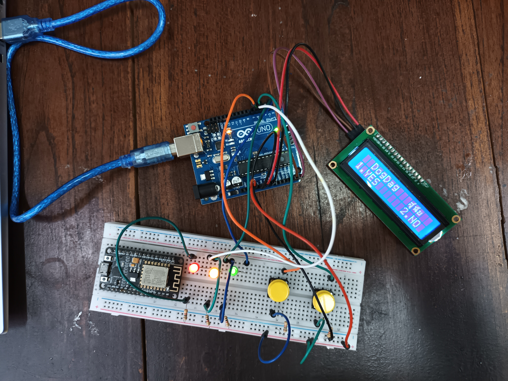

# English vocabulary quiz game

  

> เป็นคำถามที่เกี่ยวกับคำศัพท์ภาษาอังกฤษ และมีคำแปลภาษาไทยต่อท้าย ให้ทายว่าคำแปลตรงกับคำภาษาอังกฤษหรือไม่

โดยมี 2 ตัวเลือก แสดงผลผ่านจอ LCD คือ 
1. YES ใช้ปุ่ม sw2 ในการ input 
2. NO ใช้ปุ่ม sw1 ในการ input 

- มีพลังชีวิต เพื่อใช้ในการจบเกม โดยใช้หลอดไฟ LED แสดงพลังชีวิต จำนวน 3 หลอด(แทนการ
  - ตอบผิดทั้งหมด 3 ครั้ง)
  - เมื่อตอบคำถาม “ผิด” ไฟจะดับครั้งละ 1 ดวง และเมื่อไฟดับครบทั้ง 3 ดวง จะแสดง Score ขึ้นมา 
- Score จะแสดงก็ต่อเมื่อพลังชีวิตหมด หรือตอบผิดครบจำนวน 3 ครั้ง

__อุปกรณ์ที่ใช้__

- Arduino Board 
- เบรดบอร์ด
- สาย USB 
- จอ LCD 
- หลอด LED
- ปุ่ม 
- สายคู่ผู้-ผู้ 
- สายคู่ผู้-เมีย
